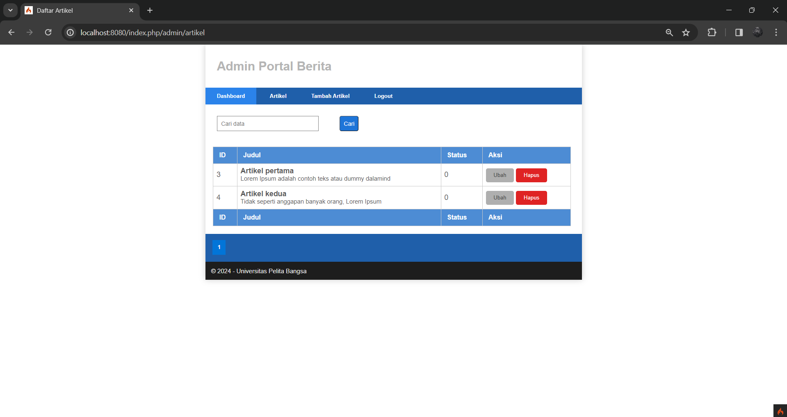

|             |                                  |
| ----------- | -------------------------------  |
| Nama        | Muhammad Riadus Solihin  |
| NIM         | 312210404                      |
| Kelas       | TI.22.A.4                        |
| Mata Kuliah | Pemrograman Web 2                |

# Praktikum 4: Framework Lanjutan (Modul Login)

## Langkah-Langkah Praktikum

1. Persiapan
   Untuk memulai membuat aplikasi CRUD sederhana,
   yang perlu disiapkan adalah database server menggunakan MySQL.
   Pastikan MySQL Server sudah dapat dijalankan melalui
   XAMPP

2. Membuat Tabel: User Login

```sql
CREATE TABLE user (
 id INT(11) auto_increment,
 username VARCHAR(200) NOT NULL,
 useremail VARCHAR(200),
 userpassword VARCHAR(200),
 PRIMARY KEY(id)
);
```


3. Membuat Model User

Selanjutnya adalah membuat Model untuk memproses data Login.
Buat file baru pada direktori app/Models dengan nama UserModel.php

```php
<?php
namespace App\Models;
use CodeIgniter\Model;
class UserModel extends Model
{
 protected $table = 'user';
 protected $primaryKey = 'id';
protected $useAutoIncrement = true;
 protected $allowedFields = ['username', 'useremail', 'userpassword'];
}
```

4. Membuat Controller User

Buat Controller baru dengan nama User.php pada direktori app/Controllers.
Kemudian tambahkan method index() untuk menampilkan daftar user,
dan method login() untuk proses login.

```php
<?php
namespace App\Controllers;
use App\Models\UserModel;
class User extends BaseController
{
 public function index()
 {
 $title = 'Daftar User';
 $model = new UserModel();
 $users = $model->findAll();
 return view('user/index', compact('users', 'title'));
 }
 public function login()
 {
 helper(['form']);
 $email = $this->request->getPost('email');
 $password = $this->request->getPost('password');
 if (!$email)
 {
 return view('user/login');
 }
 $session = session();
 $model = new UserModel();
 $login = $model->where('useremail', $email)->first();
 if ($login)
 {
 $pass = $login['userpassword'];
 if (password_verify($password, $pass))
 {
 $login_data = [
 'user_id' => $login['id'],
 'user_name' => $login['username'],
 'user_email' => $login['useremail'],
 'logged_in' => TRUE,
 ];
$session->set($login_data);
 return redirect('admin/artikel');
 }
 else
 {
 $session->setFlashdata("flash_msg", "Password salah.");
 return redirect()->to('/user/login');
 }
 }
 else
 {
 $session->setFlashdata("flash_msg", "email tidak terdaftar.");
 return redirect()->to('/user/login');
 }
 }
}
```

5. Membuat View Login

Buat direktori baru dengan nama user pada direktori app/views,
kemudian buat file baru dengan nama login.php.

```php
<!DOCTYPE html>
<html lang="en">
<head>
 <meta charset="UTF-8">
 <title>Login</title>
 <link rel="stylesheet" href="<?= base_url('/style.css');?>">
</head>
<body>
 <div id="login-wrapper">
 <h1>Sign In</h1>
 <?php if(session()->getFlashdata('flash_msg')):?>
 <div class="alert alert-danger"><?= session()-
>getFlashdata('flash_msg') ?></div>
 <?php endif;?>
 <form action="" method="post">
 <div class="mb-3">
 <label for="InputForEmail" class="form-label">Email
address</label>
 <input type="email" name="email" class="form-control"
id="InputForEmail" value="<?= set_value('email') ?>">
 </div>
 <div class="mb-3">
 <label for="InputForPassword" class="form-label">Password</label>
 <input type="password" name="password" class="form-control" id="InputForPassword">
 </div>
 <button type="submit" class="btn btn-primary">Login</button>
 </form>
 </div>
</body>
</html>
```

6. Membuat Database Seeder

Database seeder digunakan untuk membuat data dummy.
Untuk keperluan ujicoba modul login, kita perlu memasukkan data user dan password kedaalam database.
Untuk itu buat database seeder untuk tabel user.
Buka CLI, kemudian tulis perintah berikut:


Selanjutnya, buka file UserSeeder.php yang berada di lokasi direktori
/app/Database/Seeds/UserSeeder.php kemudian isi dengan kode berikut:

```php
<?php
namespace App\Database\Seeds;
use CodeIgniter\Database\Seeder;
class UserSeeder extends Seeder
{
public function run()
{
$model = model('UserModel');
$model->insert([
'username' => 'admin',
'useremail' => 'admin@email.com',
'userpassword' => password_hash('admin123', PASSWORD_DEFAULT),
]);
}
}
```

Selanjutnya buka kembali CLI dan ketik perintah berikut:


7. Menambahkan Auth Filter

Selanjutnya membuat filer untuk halaman admin. Buat file baru dengan nama Auth.php pada
direktori app/Filters.

```php
<?php namespace App\Filters;
use CodeIgniter\HTTP\RequestInterface;
use CodeIgniter\HTTP\ResponseInterface;
use CodeIgniter\Filters\FilterInterface;
class Auth implements FilterInterface
{
public function before(RequestInterface $request, $arguments = null)
{
// jika user belum login
if(! session()->get('logged_in')){
// maka redirct ke halaman login
return redirect()->to('/user/login');
}
}
public function after(RequestInterface $request, ResponseInterface
$response, $arguments = null)
{
// Do something here
}
}
```

Selanjutnya buka file app/Config/Filters.php tambahkan kode berikut:

`'auth' => App\Filters\Auth::class`

Selanjutnya buka file app/Config/Routes.php dan sesuaikan kodenya.

```php
$routes->group('admin', ['filter' => 'auth'], function ($routes) {
    $routes->get('artikel', 'Artikel::admin_index');
    $routes->add('artikel/add', 'Artikel::add');
    $routes->add('artikel/edit/(:any)', 'Artikel::edit/$1');
    $routes->get('artikel/delete/(:any)', 'Artikel::delete/$1');
    $routes->add('logout', 'User::logout');
});
```


8. Fungsi Logout

Tambahkan method logout pada Controller User seperti berikut:

```php
public function logout()
 {
session()->destroy();
 return redirect()->to('/user/login');
 }
```

# Praktikum 5: Pagination dan Pencarian

## Langkah-Langkah Praktikum

1. Membuat Pagination

Pagination merupakan proses yang digunakan untuk membatasi tampilan yang panjang dari data yang banyak pada sebuah website.
Fungsi pagination adalah memecah tampilan menjadi beberapa halaman tergantung banyaknya data yang akan ditampilkan pada setiap halaman.

Pada Codeigniter 4, fungsi pagination sudah tersedia pada Library sehingga cukup mudah menggunakannya.

Untuk membuat pagination, buka Kembali Controller Artikel, kemudian modifikasi kode pada method admin_index seperti berikut.

```php
public function admin_index()
 {
 $title = 'Daftar Artikel';
 $model = new ArtikelModel();
 $data = [
 'title' => $title,
 'artikel' => $model->paginate(10), #data dibatasi 10 record
per halaman
 'pager' => $model->pager,
 ];
 return view('artikel/admin_index', $data);
 }
```

Kemudian buka file views/artikel/admin_index.php dan tambahkan kode berikut
dibawah deklarasi tabel data

```php
<?= $pager->links(); ?>
```

2. Membuat Pencarian

Pencarian data digunakan untuk memfilter data.
Untuk membuat pencarian data, buka kembali Controller Artikel,
pada method admin_index ubah kodenya seperti berikut.

```php
public function admin_index()
 {
 $title = 'Daftar Artikel';
 $q = $this->request->getVar('q') ?? '';
 $model = new ArtikelModel();
 $data = [
 'title' => $title,
 'q' => $q,
 'artikel' => $model->like('judul', $q)->paginate(10), # data
dibatasi 10 record per halaman
 'pager' => $model->pager,
 ];
 return view('artikel/admin_index', $data);
 }
```

Kemudian buka kembali file views/artikel/admin_index.php dan tambahkan form
pencarian sebelum deklarasi tabel seperti berikut:

```php
<form method="get" class="form-search">
 <input type="text" name="q" value="<?= $q; ?>" placeholder="Cari data">
 <input type="submit" value="Cari" class="btn btn-primary">
</form>
```

Dan pada link pager ubah seperti berikut.

```php
<?= $pager->only(['q'])->links(); ?>
```

### Output Final Tampilan Website Praktikum 5




# Praktikum 6: Upload File Gambar

## Instruksi Praktikum

1. Persiapkan text editor misalnya VSCode.
2. Buka kembali folder dengan nama lab12_ci pada docroot webserver (htdocs)
3. Ikuti langkah-langkah praktikum yang akan dijelaskan berikutnya.

## Langkah-langkah Praktikum

### Upload Gambar pada Artikel

Menambahkan fungsi unggah gambar pada tambah artikel.

1. Buka kembali `Controller Artikel` pada project sebelumnya, sesuaikan kode pada method **add** seperti berikut:

```php
     public function add()
     {
     // validasi data.
     $validation = \Config\Services::validation();
     $validation->setRules(['judul' => 'required']);
     $isDataValid = $validation->withRequest($this->request)->run();

     if ($isDataValid)
     {
         $file = $this->request->getFile('gambar');
         $file->move(ROOTPATH . 'public/gambar');

         $artikel = new ArtikelModel();
         $artikel->insert([
             'judul' => $this->request->getPost('judul'),
             'isi' => $this->request->getPost('isi'),
             'slug' => url_title($this->request->getPost('judul')),
             'gambar' => $file->getName(),
         ]);
         return redirect('admin/artikel');
     }
     $title = "Tambah Artikel";
     return view('artikel/form_add', compact('title'));
     }
```

2. Kemudian pada file `views/artikel/form_add.php` tambahkan field input file seperti berikut.

```html
<p>
  <input type="file" name="gambar" />
</p>
```

3. Sesuaikan tag form dengan menambahkan encrypt type seperti berikut.

```html
<form action="" method="post" enctype="multipart/form-data"></form>
```

4. Ujicoba file upload dengan mengakses menu tambah artikel.

